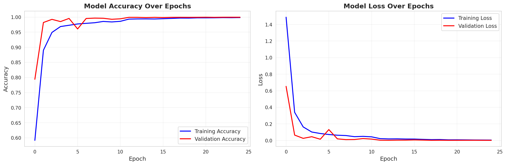
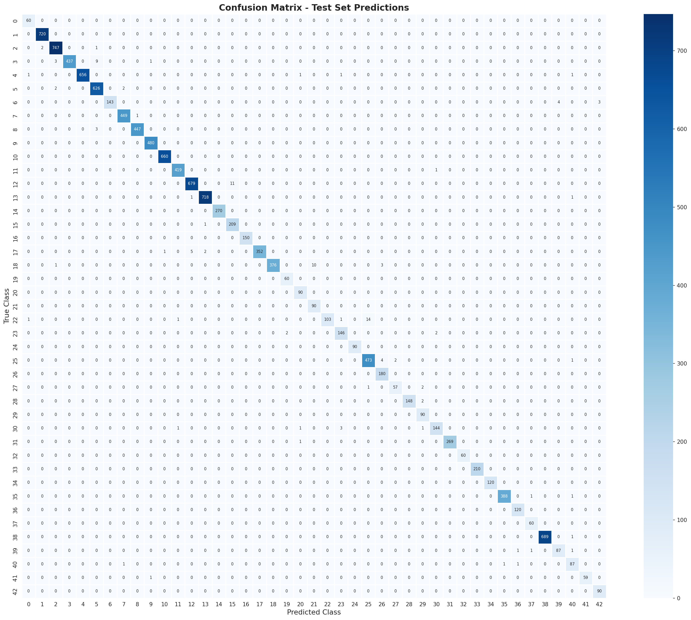
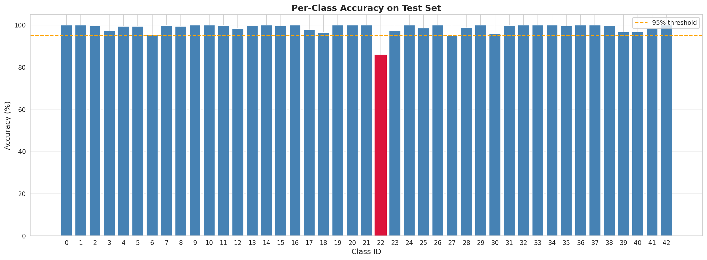
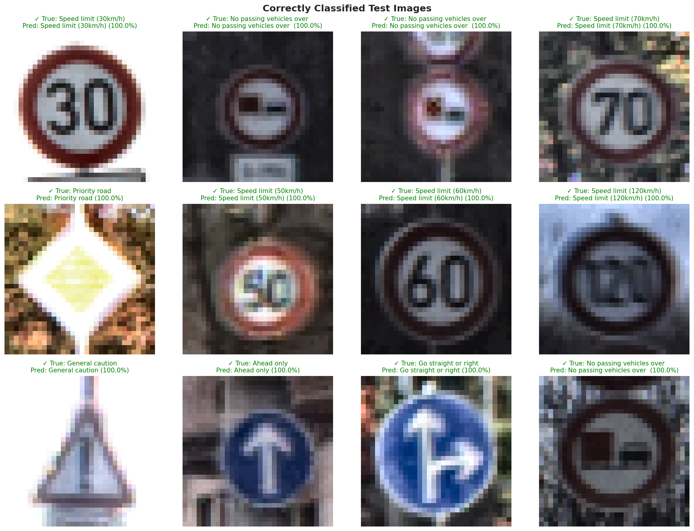
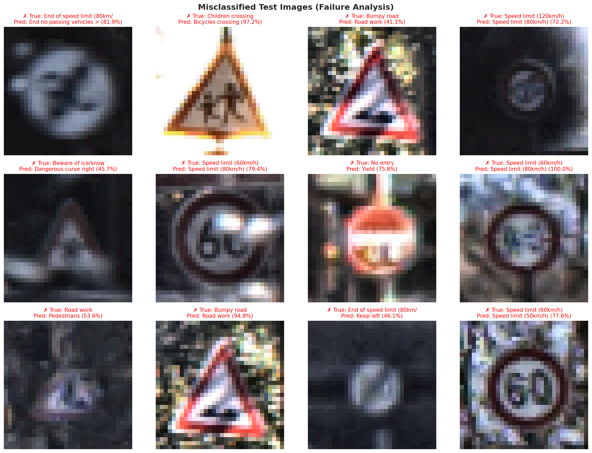
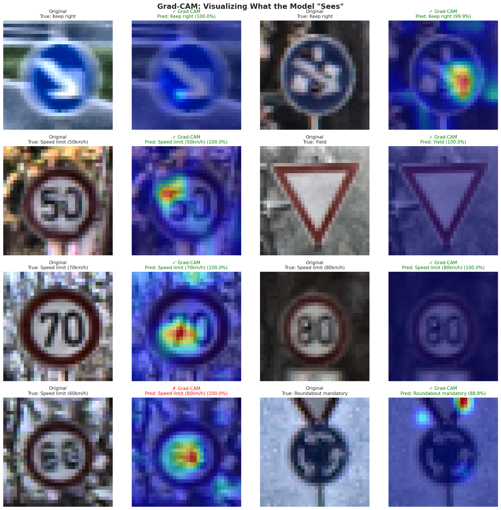
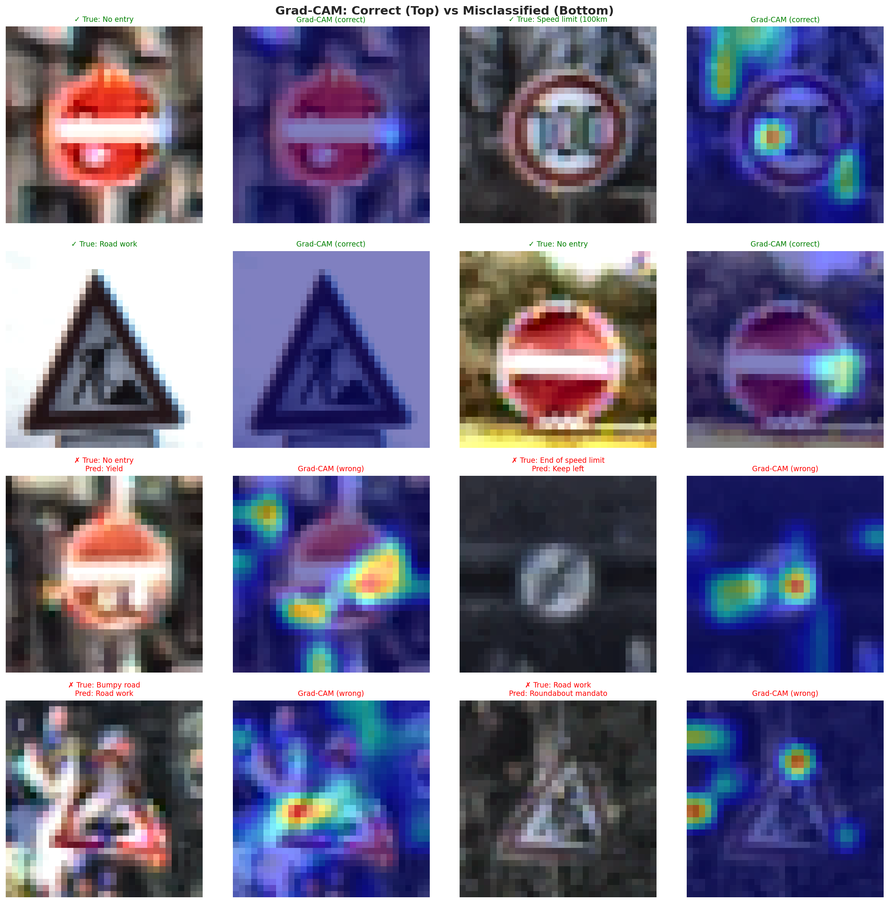

<div align="center">

# 🚦 Traffic Sign Recognition

**An end-to-end deep learning system for classifying 43 types of German traffic signs with 99.03% accuracy**

[](https://python.org)
[](https://www.tensorflow.org/)
[](https://streamlit.io/)
[](https://opencv.org/)
[](LICENSE)

<br/>

*Combining classical image processing with modern deep learning for real-world traffic sign classification.*

---

</div>

## 📑 Table of Contents

- [Overview](#-overview)
- [Key Results](#-key-results)
- [Dataset](#-dataset)
- [Model Architecture](#-model-architecture)
- [Image Processing Pipeline](#-image-processing-pipeline)
- [Training & Evaluation](#-training--evaluation)
- [Grad-CAM Explainability](#-grad-cam-explainability)
- [Web Demo (Streamlit)](#-web-demo-streamlit)
- [Project Structure](#-project-structure)
- [Getting Started](#-getting-started)
- [Technologies Used](#-technologies-used)
- [Future Work](#-future-work)

---

## 🔍 Overview

Traffic Sign Recognition (TSR) is a critical component of autonomous driving, Advanced Driver Assistance Systems (ADAS), and smart transportation infrastructure. This project implements an end-to-end pipeline that:

1. **Preprocesses** raw traffic sign images using CLAHE contrast enhancement and normalization.
2. **Trains** a custom Convolutional Neural Network on the [GTSRB](https://benchmark.ini.rub.de/gtsrb_dataset.html) benchmark dataset.
3. **Evaluates** performance with detailed per-class metrics, confusion matrices, and visual analysis.
4. **Explains** model decisions using **Grad-CAM** heatmaps for interpretability.
5. **Deploys** the model via an interactive **Streamlit** web application for real-time inference.

---

## 🏆 Key Results

<div align="center">

| Metric | Value |
|:---|:---:|
| **Test Accuracy** | **99.03%** |
| **Validation Accuracy** | 99.97% |
| **Test Loss** | 0.0449 |
| **Total Test Images** | 12,630 |
| **Correctly Classified** | 12,508 |
| **Misclassified** | 122 |
| **Total Parameters** | ~600,000 |
| **Epochs Trained** | 25 |

</div>

---

## 📊 Dataset

This project uses the **German Traffic Sign Recognition Benchmark (GTSRB)** — a widely used academic benchmark from the IJCNN 2011 competition.

| Property | Detail |
|:---|:---|
| Classes | **43** distinct traffic sign categories |
| Training images | ~39,000 |
| Test images | ~12,600 |
| Image size (model input) | 32 × 32 × 3 (RGB) |

The 43 classes span speed limits, prohibitions, warnings, and mandatory signs:

<details>
<summary><b>Click to expand all 43 classes</b></summary>

| ID | Sign Name | ID | Sign Name |
|:--:|:---|:--:|:---|
| 0 | Speed limit (20km/h) | 22 | Bumpy road |
| 1 | Speed limit (30km/h) | 23 | Slippery road |
| 2 | Speed limit (50km/h) | 24 | Road narrows on the right |
| 3 | Speed limit (60km/h) | 25 | Road work |
| 4 | Speed limit (70km/h) | 26 | Traffic signals |
| 5 | Speed limit (80km/h) | 27 | Pedestrians |
| 6 | End of speed limit (80km/h) | 28 | Children crossing |
| 7 | Speed limit (100km/h) | 29 | Bicycles crossing |
| 8 | Speed limit (120km/h) | 30 | Beware of ice/snow |
| 9 | No passing | 31 | Wild animals crossing |
| 10 | No passing vehicles over 3.5t | 32 | End speed + passing limits |
| 11 | Right-of-way at intersection | 33 | Turn right ahead |
| 12 | Priority road | 34 | Turn left ahead |
| 13 | Yield | 35 | Ahead only |
| 14 | Stop | 36 | Go straight or right |
| 15 | No vehicles | 37 | Go straight or left |
| 16 | Vehicles > 3.5t prohibited | 38 | Keep right |
| 17 | No entry | 39 | Keep left |
| 18 | General caution | 40 | Roundabout mandatory |
| 19 | Dangerous curve left | 41 | End of no passing |
| 20 | Dangerous curve right | 42 | End no passing veh. > 3.5t |
| 21 | Double curve | | |

</details>

---

## 🧠 Model Architecture

The classifier is a **custom CNN** designed from scratch with three convolutional blocks:

```
Input (32×32×3)
  │
  ├── Conv Block 1 ─── Conv2D(32) → BatchNorm → ReLU → Conv2D(32) → BatchNorm → ReLU → MaxPool → Dropout
  │
  ├── Conv Block 2 ─── Conv2D(64) → BatchNorm → ReLU → Conv2D(64) → BatchNorm → ReLU → MaxPool → Dropout
  │
  ├── Conv Block 3 ─── Conv2D(128) → BatchNorm → ReLU → Conv2D(128) → BatchNorm → ReLU → MaxPool → Dropout
  │
  ├── Flatten
  │
  ├── Dense(512) → BatchNorm → ReLU → Dropout
  │
  └── Dense(43, softmax)  →  Output (43 classes)
```

**Key design choices:**
- **Batch Normalization** after every convolutional and dense layer for stable, fast training.
- **Dropout** at multiple stages to prevent overfitting on the relatively small dataset.
- **Progressive filter growth** (32 → 64 → 128) to capture increasingly complex features.

---

## 🖼️ Image Processing Pipeline

Every image passes through a consistent preprocessing pipeline before inference:

```
Raw Image  →  Resize (32×32)  →  CLAHE Enhancement  →  Normalize [0, 1]  →  Model Input
```

| Step | Technique | Purpose |
|:---|:---|:---|
| 1 | **Resize** | Standardize all inputs to 32×32 pixels |
| 2 | **CLAHE** | Contrast Limited Adaptive Histogram Equalization — normalizes lighting and enhances details in shadows and highlights |
| 3 | **Color Space Conversion** | RGB → LAB (apply CLAHE to L channel) → RGB |
| 4 | **Normalization** | Scale pixel values from [0, 255] to [0, 1] |
| 5 | **Data Augmentation** *(training only)* | Random rotation, shift, zoom, and shear for robustness |

---

## 📈 Training & Evaluation

### Training Curves

<!-- 📊 TRAINING CURVES GRAPH -->
<!-- Replace the line below with your training_curves.png screenshot -->



<br/>

### Confusion Matrix

<!-- 📊 CONFUSION MATRIX GRAPH -->
<!-- Replace the line below with your confusion_matrix.png screenshot -->



<br/>

### Per-Class Accuracy

<!-- 📊 PER-CLASS ACCURACY GRAPH -->
<!-- Replace the line below with your per_class_accuracy.png screenshot -->



<br/>

### Sample Predictions

#### ✅ Correct Predictions

<!-- 📊 CORRECT PREDICTIONS GRAPH -->
<!-- Replace the line below with your correct_predictions.png screenshot -->



<br/>

#### ❌ Wrong Predictions

<!-- 📊 WRONG PREDICTIONS GRAPH -->
<!-- Replace the line below with your wrong_predictions.png screenshot -->



---

## 🔥 Grad-CAM Explainability

**Gradient-weighted Class Activation Mapping (Grad-CAM)** provides visual explanations for the model's predictions by highlighting the regions of the image that most influenced the classification.

- **Red/warm areas** → High importance (the model focused here)
- **Blue/cool areas** → Low importance

### Grad-CAM Visualization

<!-- 📊 GRAD-CAM VISUALIZATION GRAPH -->
<!-- Replace the line below with your gradcam_visualization.png screenshot -->



<br/>

### Correct vs. Wrong Predictions (Grad-CAM)

<!-- 📊 GRAD-CAM CORRECT VS WRONG GRAPH -->
<!-- Replace the line below with your gradcam_correct_vs_wrong.png screenshot -->



---

## 🌐 Web Demo (Streamlit)

The project includes a fully interactive **Streamlit** web application with four pages:

| Page | Description |
|:---|:---|
| 🎯 **Live Demo** | Upload any traffic sign image → get instant AI prediction with confidence scores and Grad-CAM heatmap |
| 📊 **Project Metrics** | View training curves, confusion matrix, per-class accuracy, and evaluation metrics |
| 🧠 **About the Model** | Detailed architecture breakdown, training hyperparameters, and preprocessing techniques |
| 📚 **About the Project** | Project motivation, dataset info, technologies used, and future roadmap |

### Running the Demo

```bash
streamlit run app.py
```

The app features:
- **Real-time inference** with top-5 prediction probabilities displayed as interactive Plotly charts.
- **Grad-CAM overlay** on uploaded images to visualize model attention.
- **Confidence indicators** — color-coded feedback for prediction reliability.
- Professional UI with custom CSS styling and responsive layout.

---

## 📁 Project Structure

```
Traffic Sign Recognition/
│
├── Traffic_sign_recognetion.ipynb   # Full training & evaluation notebook
├── app.py                           # Streamlit web application
│
├── best_custom_cnn.keras            # Best model checkpoint (during training)
├── traffic_sign_model_final.keras   # Final trained model (used for inference)
│
├── class_names.json                 # Mapping of 43 class IDs → sign names
├── metrics_summary.json             # Key performance metrics (JSON)
├── requirements.txt                 # Python dependencies
│
├── training_curves.png              # Accuracy & loss over epochs
├── confusion_matrix.png             # 43×43 confusion matrix heatmap
├── per_class_accuracy.png           # Bar chart of accuracy per class
├── correct_predictions.png          # Grid of correctly classified samples
├── wrong_predictions.png            # Grid of misclassified samples
├── gradcam_visualization.png        # Grad-CAM heatmap examples
└── gradcam_correct_vs_wrong.png     # Grad-CAM comparison: correct vs wrong
```

---

## 🚀 Getting Started

### Prerequisites

- **Python 3.10+**
- **pip** package manager

### Installation

1. **Clone the repository**
   ```bash
   git clone https://github.com/<your-username>/traffic-sign-recognition.git
   cd traffic-sign-recognition
   ```

2. **Create a virtual environment** *(recommended)*
   ```bash
   python -m venv venv
   source venv/bin/activate        # Linux / macOS
   venv\Scripts\activate           # Windows
   ```

3. **Install dependencies**
   ```bash
   pip install -r requirements.txt
   ```

4. **Download the dataset**

   Download the [GTSRB dataset](https://www.kaggle.com/datasets/meowmeowmeowmeowmeow/gtsrb-german-traffic-sign) and place the ZIP file in the project root directory.

5. **Train the model** *(optional — a pre-trained model is included)*

   Open and run `Traffic_sign_recognetion.ipynb` in Jupyter Notebook or JupyterLab.

6. **Launch the web demo**
   ```bash
   streamlit run app.py
   ```

---

## 🛠️ Technologies Used

| Technology | Role |
|:---|:---|
| **Python 3.10+** | Core programming language |
| **TensorFlow / Keras 2.15** | Deep learning model training & inference |
| **OpenCV 4.9** | Image processing (CLAHE, color space conversion, resizing) |
| **NumPy 1.26** | Numerical computation & array operations |
| **Pandas 2.2** | Data manipulation & analysis |
| **Matplotlib 3.8** | Static visualizations (training curves, confusion matrix) |
| **Plotly 5.18** | Interactive charts in the Streamlit demo |
| **Streamlit 1.31** | Web application framework for the live demo |
| **Pillow 10.2** | Image I/O for user uploads |

---

## 🔮 Future Work

- [ ] **Real-time video detection** — extend from classification to detection + localization in video streams
- [ ] **Edge deployment** — optimize and deploy on Raspberry Pi or mobile devices using TFLite
- [ ] **Multi-country support** — train on traffic signs from other countries (US, UK, etc.)
- [ ] **Ensemble methods** — combine multiple models to further reduce misclassifications
- [ ] **Transfer learning** — experiment with pre-trained backbones (EfficientNet, ResNet) for comparison

---
